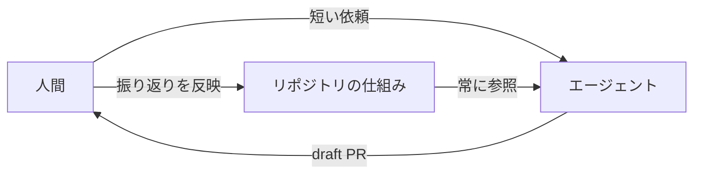
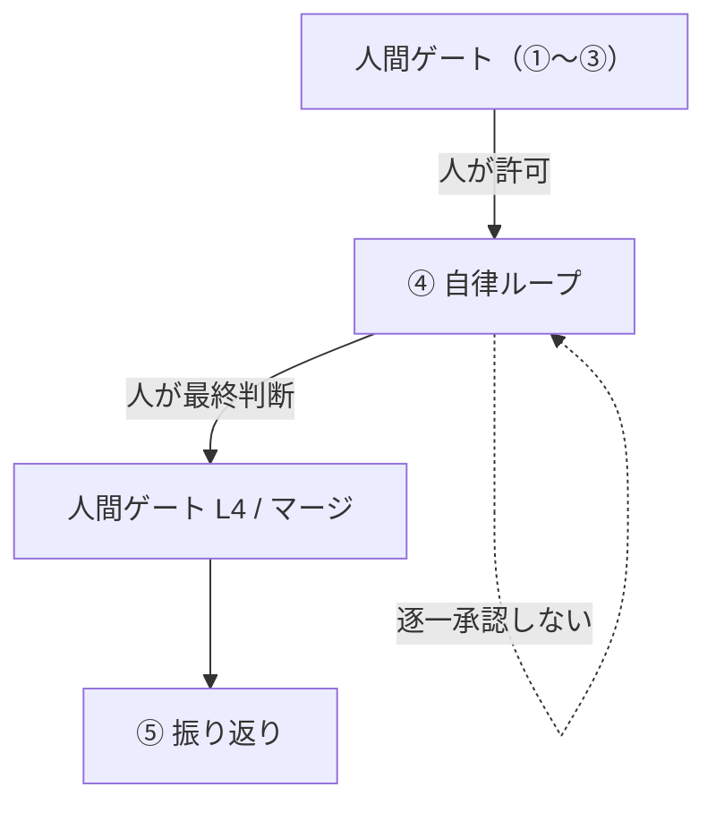
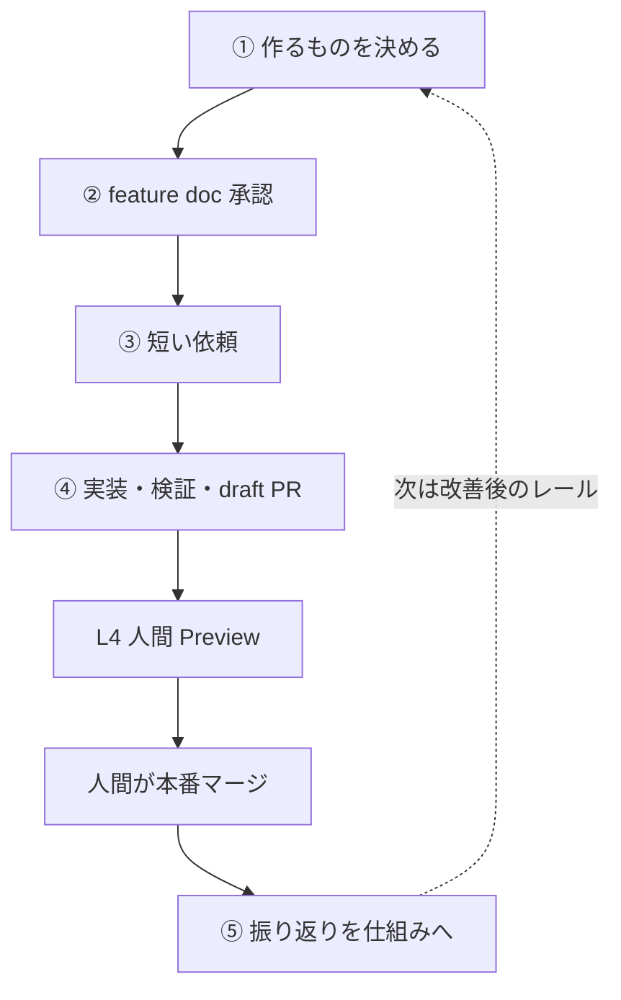

# AI フル活用の開発プロセス入門（QA向け）

この資料は、**QAエンジニア**が「AIエージェントとどう協業するか」を理解するための入門です。  
プロダクト自体の説明はしません。**開発の進め方・仕組み・用語**に絞ります。

## この資料の使い方

| | |
| --- | --- |
| 想定読者 | QAエンジニア（AI開発の用語にはまだ馴染みがない前提） |
| 目的 | 「誰が何を保証しているか」を把握し、自分の持ち場を判断できるようにする |
| 読み方 | §1〜§2 が要点。時間がなければ §1・§2・§6・§8 だけでよい |

### 30秒サマリ

- このリポジトリは **HITL（Human in the Loop）** — 人間の承認ゲートが無いと先に進まない設計です
- 人間が決めるのは **「作るものの契約」と「受け入れ」**。実装と一次検証はエージェントが担います
- 品質は「頑張って」ではなく、**リポジトリに置いた仕組み**（ルール・スキル・サブエージェント・テスト）で担保します
- QAの持ち場は **② feature doc の承認**と **L4（人間の Preview 受け入れ）**、そして**穴を仕組みに戻すこと**
- 実際に L4 で見つかった不具合は「機能は動くが体験が壊れている」型が多く、**人間の観察が効く領域が残っています**（§7）

正本の詳細は §10 の関連ドキュメントを参照してください。この資料は**地図**です。

---

## 1. 全体像

従来の「人が仕様を書いて人が実装し人がテストする」に対し、このリポジトリでは:

1. **振る舞いの契約**（feature doc）を人間が決める
2. **実装・自己検証・draft PR** はエージェントが担う
3. **受け入れの最終判断**は人間（QA）が Preview で行う
4. 失敗や抜け漏れは、次から繰り返さないよう **仕組みに書き戻す**

つまり「AIに丸投げ」ではなく、**AIが外れにくいレールをリポジトリに敷く**開発です。  
協業の型で言うと、いまのフローは **HITL** です（§2）。



- **人間** … 決める・承認する・受け入れる
- **エージェント** … 実装する・自己検証する・draft PR を出す
- **リポジトリの仕組み** … `docs` / `skills` / `rules` / `agents`

最後の矢印（振り返りを反映）が、この開発の要点です。**同じ指摘を二度しないために、指摘を仕組みへ書き戻します。**

---

## 2. HITL と HOTL（人間の入り方）

AIエージェント開発では、「人間がループのどこにいるか」で設計が大きく変わります。

### 2.1 用語

| 略語 | 英語 | 一言 |
| --- | --- | --- |
| **HITL** | Human **in** the Loop | 人間が**ゲート**としてループの中に入る。次に進むには人間の判断が必要 |
| **HOTL** | Human **on** the Loop | 人間は**監視・介入役**としてループの外（上）にいる。通常は自動で進み、異常時に人が止める |
| （参考）HOOTL | Human **out of** the Loop | 完全自律。人は事後に結果を見るだけ |

自律度の軸で並べると、この3つは連続したスペクトラムです。

```text
HITL ────────────── HOTL ────────────── HOOTL
人が許可しないと      通常は自動で進み、        人の介在なし
進まない（ゲート）     異常時に人が止める（監視）    （事後確認のみ）

← 安全・遅い                              速い・影響範囲が大きい →
```

### 2.2 違い（QAが意識するところ）

| 観点 | HITL | HOTL |
| --- | --- | --- |
| 人間の役割 | 承認者・最終判定者 | 監視者・エスカレーション先 |
| 進行条件 | 主要ゲートで人の Yes が必要 | 基本は自動進行。人が止めない限り続く |
| 速度 | ゲート待ちで遅くなる | 速いが、誤作動の影響範囲が大きくなりやすい |
| 品質の置き場所 | 人の判断 + 仕組み | 仕組み・監視・自動ロールバックの比重が高い |
| 失敗時 | ゲートで止めやすい | 事後検知・事後介入が中心 |
| QAの仕事 | 契約承認・Preview受け入れが本業 | アラート対応・サンプリング監査・仕組みの穴探しが本業になりやすい |
| 成立条件 | 人が見る時間を確保できること | 自動検証・監視・巻き戻しが十分に整っていること |

どちらが「上級」という話ではありません。**リスクと自律度のトレードオフ**です。  
自動検証が薄いまま HOTL にすると、「速く間違え、後から気づく」状態になります。

### 2.3 このリポジトリは HITL

いまの①〜⑤には、次の**人間ゲート**があります。ゆえに HITL です。

| ゲート | 誰が | 何を止めるか |
| --- | --- | --- |
| ① スコープ決定 | 人間 | 「何を作るか」をエージェントが勝手に増やさない |
| ② feature doc 承認 | 人間（QA / プロダクト） | 未承認のまま実装に入らない |
| ③ 依頼 | 人間 | 実装開始のトリガーは人 |
| L4 Preview | 人間（QA） | 新規画面・新規フロー等は人が受け入れる |
| Production マージ（D1） | **人間のみ** | エージェントは draft PR まで。本番投入は人が決める |

**HOTL ではない理由:**

- feature doc 未承認でも実装が進む、は許容していない（実際に一度スキップが起きて仕組みを固めた → §7.2）
- Preview 受け入れや Production マージをエージェント任せにしない
- 「異常が出たら人が止める」監視モデルではなく、**「人が OK するまで進まない」ゲートモデル**

### 2.4 ただし④の内側は HOTL 的

正確に言うと、**フロー全体は HITL、ゲートと次のゲートの間（とくに④の実装〜検証）は HOTL 的**です。



`④ 自律ループ` の中身は「実装 → L0〜L3 → 失敗 → 修正 → draft PR」です。エージェントはこれを**逐一の承認なしに**繰り返し、人はその区間を監視するだけです（HOTL 的）。だから④の内側の品質は、人の承認ではなく **§3.3 のハーネスと §3.4 のループ設計**に依存します。

この区別が実務上重要です。

- **ゲートの品質**（②の契約、L4 の受け入れ） → 人間の書き方・見方の問題
- **ゲート間の品質**（④の中） → 仕組み（テスト・検証スキル・サブエージェント判定）の問題

L4 で不具合が出たとき、「人が見落とした」ではなく **「④の仕組みのどこに穴があったか」**を問うのが⑤振り返りです。

### 2.5 将来 HOTL に寄せるなら（参考）

いまは意図的に HITL です。低リスク変更から HOTL 寄りにするなら、前提が要ります。

| 必要なもの | いまの状況 |
| --- | --- |
| 変更タイプごとの検証基準 | あり（L0–L4 ルール表） |
| 自動テスト | あり（unit / E2E。ただし実行は手動トリガー） |
| **CI での自動実行** | **未整備**（GitHub Actions なし。§6.2） |
| 失敗時の自動ロールバック | 未整備 |
| 監視・アラート | 未整備 |
| サンプリング監査の設計 | 未整備 |

すでに部分的な緩和はしています（docs / 文言のみで振る舞い不変なら L0 のみ、など）。一方で **認証・権限・削除・新規フローは、しばらく HITL（L4 + 人間マージ）のまま**が安全です。

QAへの含意: **いまの本業は「ゲートを正しく・検証可能に運用すること」**です。監視型（HOTL）の本業とは違います。

---

## 3. 知っておくとよい4つの考え方

用語の理解が浅い前提で説明します。実務では厳密な定義より、「何を設計しているか」の感覚が重要です。

### 3.1 プロンプトエンジニアリング（Prompt Engineering）

**定義:** エージェントへの**依頼文の書き方**を工夫すること。

悪い例（長い仕様をチャットに全部書く）:

```text
レシピ一覧を作って。タイトルと日付が見えて、空のときは案内が出て、
ログイン必須で、モバイルでも見やすくて、SQLはこうで…
```

良い例（このリポジトリの方針）:

```text
feature doc: docs/product/features/recipe-list.md
vision: docs/product/vision.md

上記 feature doc の §1〜6（とくに §5 Gherkin と §6）を満たす実装と draft PR まで。
やらないことは §4 に従う。マージしない。
```

ポイント:

- **依頼文は短く**、詳細はドキュメントに置く
- 「何をもって完了か」「やってはいけないこと」を明示する
- Production マージは人間、など**境界**を書く

なぜチャットに仕様を書かないか: チャットは**流れて消える**うえ、後から参照できません。仕様がチャットにあると、次の依頼で同じ説明を書き直すことになり、しかも「どれが最新か」が分からなくなります。

QAとの関係: プロンプトを書くのは主に依頼者の仕事ですが、**受け入れ可能な条件を feature doc に書くこと自体が、良いプロンプトの土台**です。

---

### 3.2 コンテキストエンジニアリング（Context Engineering）

**定義:** エージェントが「今なにを見て考えるか」を設計すること。  
モデルは会話・ファイル・ルールを全部一度に完璧には抱えられません。**必要な情報を、必要なタイミングで届ける**のがコンテキスト設計です。

このリポジトリでの置き場所:

| 置き場所 | いつ読まれるか | 何を置くか |
| --- | --- | --- |
| `AGENTS.md` | ほぼ毎回 | コマンド、地図、絶対守ること（短く） |
| `.cursor/rules/*.mdc` | 該当パスの編集時 | その領域だけの制約 |
| `docs/` | 参照したとき | vision / feature / workflow など長めの正本 |
| feature doc | 実装・検証の契約 | 振る舞い・Gherkin・受け入れ条件 |
| スキル / サブエージェント | タスクに応じて | 手順や独立した判定 |

悪い例:

- `AGENTS.md` に全チェックリストを詰め込み、毎回トークンを浪費する（無関係な作業でも読まれる）
- 仕様が Issue・チャット・PRに散らばり、どれが正本か分からない

良い例:

- 常時必要なことだけ always-on にする
- 振る舞いの正本は feature doc 1枚に集約する
- 長い手順はスキルに分離する（必要なときだけ読まれる）

QAとの関係: **§5 Gherkin / §6 受け入れ条件を検証可能な文で書く**ことが、エージェント（と後から見る人間）への最良のコンテキスト提供です。「いい感じ」「使いやすい」はコンテキストになりません。

---

### 3.3 ハーネスエンジニアリング（Harness Engineering）

**定義:** エージェントが**安全に・再現可能に動ける土台（ハーネス）**を整えること。  
ハーネス（harness）は「安全帯・治具」の意味で、走らせる場所と外れない仕掛けを指します。プロンプトやドキュメントだけでは、環境差分・手動セットアップ・曖昧な「完了」で破綻します。

ハーネスの例（このリポジトリ）:

| 種類 | 実体 | 役割 |
| --- | --- | --- |
| 実行環境 | `.cursor/environment.json` + Cloud の install / start | 起動時に Docker / Supabase / 依存関係 / dev server を用意 |
| 検証手順 | `verify-frontend-change` などのスキル | 「ファイルを直した＝完了」を禁止し、ブラウザ確認まで要求 |
| 自動テスト | Vitest（unit）/ Playwright（E2E） | 定量的な合否（exit code） |
| 権限・安全 | マージは人間（D1）、secrets をコミットしない | エージェントの権限境界 |
| テンプレ | feature doc / PR テンプレ | 抜け漏れをフォーマットで防ぐ |

イメージ:

```text
プロンプトだけ  → 「頑張って」と頼む（結果は運）
ハーネスあり    → 同じレール上で走らせ、完了条件を機械的に確認できる
```

**いまの弱点（正直に）:** 自動テストは揃っていますが、**CI（GitHub Actions）は未整備**です。つまり `lint` / `build` / `test:unit` / `test:e2e` は「エージェントが実行して PR に結果を書く」運用で、機械が強制しているわけではありません。QAは PR 本文の記載を、必要なら疑ってよい部分です（§6.2）。

QAとの関係: L0〜L3 の多くはハーネス側（エージェント）が担います。QAは**ハーネスが拾いきれない最終判断（L4）**と、**ハーネスの穴を見つけて仕組みに戻す**役割です。

---

### 3.4 ループエンジニアリング（Loop Engineering）

**定義:** 「集める → やる → 確かめる → 繰り返す」を、**停止条件付き**で設計すること。

```text
gather context → act → verify → repeat until stop
```

停止条件が無いループは、「たぶんできた」で止まるか、延々と直し続けます。

ループの種類（ざっくり）:

| 種類 | 例 | いつ止まるか |
| --- | --- | --- |
| ターン型 | 普通のチャット依頼 | エージェントが完了と判断 / 人間に聞く |
| ゴール型 | 「lint 0・コンソールエラー0 まで」 | 完了条件を満たす / 試行上限 |
| 振り返り型 | workflow ⑤ | 繰り返しリスクを skill / rule に書いた |

重要な原則:

- **「編集した」は完了ではない。検証して初めて完了**
- 実装した本人の「OK」は最も弱い証拠。**別コンテキストの判定者**を置く（§4.3 のサブエージェント）
- 同じ失敗が繰り返されるなら、ループの外に出して **スキル / ルール / CI に固定**する

QAとの関係: feature doc の §5 / §6 が**ゴール型ループの停止条件**そのものです。曖昧な §6 は、そのまま「曖昧な停止条件」になります。L4 で落ちた観点は、可能なら doc か skill に1行足し、次のループで同じ穴を踏みにくくします。

---

### 3.5 4つはどう繋がるか

| 層 | 問い | このリポジトリでの答え |
| --- | --- | --- |
| プロンプト | どう頼むか | 短い依頼 + feature doc 参照 |
| コンテキスト | 何を見せるか | `AGENTS.md` / rules / docs / skills の分担 |
| ハーネス | どこで・どう検証するか | Cloud環境・テスト・検証スキル・権限境界 |
| ループ | いつ止まるか・どう改善するか | L0–L4、サブエージェント判定、⑤振り返り |

**QA目線での優先度:** 4つのうち QA が直接効かせられるのは **ループ（停止条件＝受け入れ条件）**と**コンテキスト（feature doc の書き方）**です。ここが甘いと、他の2つをどれだけ磨いても品質は上がりません。

---

## 4. リポジトリ上の「仕組み部品」

Cursor（IDE / Cloud Agent）向けに、次の部品をリポジトリに置いています。

```text
リポジトリ
├── AGENTS.md                 … 毎回読む短い地図
├── docs/                     … 長い正本（workflow / feature / 方針）
└── .cursor/
    ├── rules/                … 制約（常時 or パス限定）
    ├── skills/               … 手順書（オンデマンド）
    ├── agents/               … サブエージェント（独立した判定者）
    └── environment.json      … Cloud 実行環境のハーネス
```

### 4.1 Rules（ルール）

**ルール = 守らせたい制約**。短く書きます。

- **Always-on**（`project.mdc`）: プロジェクト全体の不変条件
- **Path-scoped**: 該当ファイルを触るときだけ読まれる（例: migration を触るときだけ「RLS と grant を忘れるな」）

| ルール | 効く範囲 |
| --- | --- |
| `project.mdc` | 常時（承認ゲート、秘密情報、Next.js 16 の注意など） |
| `app-router-ui.mdc` | 画面・UI コード |
| `supabase-migrations.mdc` | DB マイグレーション |
| `testing.mdc` | テストコード・設定 |

長い手順は入れません（それはスキルの仕事）。

### 4.2 Skills（スキル）

**スキル = エージェントが自分で辿る手順書**です。タスクに合致したときだけ読み込まれます。

| スキル | いつ使うか |
| --- | --- |
| `recipe-feature` | レシピ CRUD / 画面機能の実装手順 |
| `supabase-migration` | テーブル / RLS / grant |
| `ui-design` | 見た目・ランディング |
| `verify-frontend-change` | UI変更後の自己検証（完了宣言前に必須） |
| `run-tests` | unit / E2E の実行手順 |

ポイント:

- スキルは**実装側が従うチェックリスト**（QAが読んでも意味は分かります）
- 「できたかどうかの最終判定」をスキルだけに任せるのは弱い（自分の作業を自分で採点することになる）

### 4.3 Subagents（サブエージェント）

**サブエージェント = 別の会話コンテキストで動く専門エージェント**です。  
「自分で実装して自分で合格」を避けるための**判定者**として使います。

| サブエージェント | 役割 | 段階 |
| --- | --- | --- |
| `feature-doc-reviewer` | feature doc の抜け漏れチェック | ② |
| `code-reviewer` | diff の第二レビュー（危険変更の事前確認） | ④ |
| `db-security-auditor` | **適用後のDB**で RLS / grant を検証 | ④ |
| `acceptance-verifier` | §5 / §6 をブラウザで実行（L2 / L3） | ④-3 |

なぜ分けるのか、が肝心です。

1. **利害の分離**: 実装した本人は「動いたことにしたい」バイアスを持ちます。別コンテキストの判定者は、その実装過程を見ていないので擁護しません
2. **コンテキストの分離**: SQL ダンプやブラウザ操作ログは長大です。親の会話に混ぜると他の判断精度が落ちます

QA的に言えば、**開発者とテスターを分ける**のと同じ理屈です。`acceptance-verifier` は「一次テスター」、L4 の QA は「受け入れ担当」に相当します。

スキルとの違い:

| | Skills | Subagents |
| --- | --- | --- |
| 目的 | 手順を踏む | 独立して判定する |
| 文脈 | 親の会話を引き継げる | **引き継がない**（doc パス・URL・ログイン情報を渡す必要がある） |
| 典型 | 実装・自己検証 | レビュー・受け入れ相当 |

### 4.4 Feature doc（振る舞いの契約）

主読者は **QA / プロダクト**です。技術詳細（SQL、ファイル構成）は必須ではありません。

必須は §1〜6:

| § | 内容 |
| --- | --- |
| 1 | ひとことで言うと |
| 2 | だれの・どんな場面か（ユーザー課題と提供価値） |
| 3 | できること |
| 4 | **やらないこと** |
| 5 | 操作の流れ（**Gherkin**: Given / When / Then） |
| 6 | 受け入れ条件（検証可能な文） |

この6つがエージェント実装の契約であり、QAの受け入れ観点の正本です。  
とくに **§4「やらないこと」**は、エージェントが親切心で余計な機能を足すのを防ぐ欄です（AI相手では省略できません）。

### 4.5 Hooks / CI（今後の強化余地）

「毎回必ず」守らせたいことは、プロンプトより **CI や hook** の方が信頼できます。モデルは圧力下でルールを見落とすことがあるためです。

現状このリポジトリには **hook も GitHub Actions も未導入**で、L0 / L1 はエージェントの実行と PR 記載に依存しています。ここは HOTL 化の前提でもあり（§2.5）、今後の強化候補です。

---

## 5. 開発フロー①〜⑤（QAの視点）

正本: [`workflow.md`](./workflow.md)

このフロー全体が **HITL** です（§2）。ゲートのあいだはエージェントが自走し、ゲートでは人が止めます。

| 段階 | 何をするか | 主担当 | QAがやること |
| --- | --- | --- | --- |
| ① 決める | 今やるスライスを切る（Issue + vision 更新） | 人間 | 必要ならスコープ確認 |
| ② ドキュメント化 | feature doc §1〜6 | 人間が承認（下書きはエージェント可） | **§1〜6の承認**（契約の合意） |
| ③ 依頼 | 短いプロンプトで実装依頼 | 人間 | 依頼文の確認（任意） |
| ④ 実装〜Preview | 実装・自己検証・L0〜L3・draft PR | エージェント中心 | **L4（人間 Preview）**、スコープ逸脱の確認 |
| Production | main マージ | **人間のみ** | レビュー後にマージ（または合意） |
| ⑤ 振り返り | 繰り返しリスクを仕組みへ | エージェントが自分から | 反映先の妥当性を確認、観点の追加依頼 |

重要なゲート:

- **②未承認のまま④に入らない**（「ワークフローに沿って」だけでは承認ではない。承認者欄に人の名前が必要）
- エージェントは **draft PR まで。Production マージしない（D1）**
- L4 OK / マージ後、エージェントは⑤を**自分から**始める（人間が依頼しなくても）



②と L4 が QA の主戦場です。**②で契約を曖昧にすると、L4 の判定根拠も曖昧になります。**

---

## 6. テストレベル L0〜L4

正本: [`test-level-policy.md`](./test-level-policy.md)

### 6.1 レベル定義

「全部を毎回人間がやる」ではなく、**変更タイプに応じて積み上げる**方針です。

| Level | 誰が | 何をするか |
| --- | --- | --- |
| **L0** | エージェント | `lint` / `build`（型チェック含む）/ `test:unit`（Vitest） |
| **L1** | エージェント | 既存 E2E の実行（`test:e2e`、Playwright）＝回帰 |
| **L2** | エージェント（`acceptance-verifier`） | local で §5 Gherkin / §6 をブラウザ操作で確認 |
| **L3** | エージェント（`acceptance-verifier`） | Preview 上で L2 相当（env / デプロイ絡みのとき） |
| **L4** | **人間（QA）** | Preview での最終受け入れ |

ルール表の要点（抜粋）:

| 変更タイプ | 必須レベル |
| --- | --- |
| docs / 文言のみ（振る舞い不変） | **L0 のみ** |
| 既存画面の軽い挙動変更 | L0 + L2 |
| **新規画面・新規フロー** | L0 + L2 + **L4** |
| ログイン・セッション / 権限の拡大 / 取り消し不可の削除 | L0 + L2 + **L4** |
| env・デプロイ設定の変更 | L0 + **L3** |

複数に当てはまるときは**重い方**を採用します。

### 6.2 QAが知っておくべき前提（重要）

**L0 / L1 は CI で自動実行されていません。** GitHub Actions は未整備で、エージェントがローカルで実行し、結果を PR 本文に書く運用です（Vercel の Preview ビルドはビルド失敗の検知になります）。

つまり:

- 「L0 実施済み」は**エージェントの自己申告**です
- 疑わしい場合、QAは実行ログの提示を求めてよいです
- CI 整備は明示的な改善候補です（§2.5 / §4.5）

### 6.3 PR でQAが見るところ

PR 本文には Test level 欄があります。QAは:

1. 必須レベルが妥当か見る（軽すぎ / 重すぎを指摘してよい）
2. L4 が必要なとき、feature doc §5 / §6 に沿って Preview を確認する
3. 「振る舞い不変なので L4 省略」という一次判定は**覆せる**

---

## 7. 実運用の記録（MVP完了時点）

この節が、この開発プロセスの**実証**部分です。

### 7.1 いまの整備状況

| 項目 | 数 |
| --- | --- |
| feature doc（契約） | 6（認証 / 一覧 / 詳細 / 追加 / 編集 / 削除） |
| E2E テスト（Playwright） | 6ファイル・約64ケース |
| unit テスト（Vitest） | 約42ケース |
| DB マイグレーション | 6 |
| スキル / ルール / サブエージェント | 5 / 4 / 4 |
| マージ済み PR | 22 |
| CI（GitHub Actions） | **なし**（§6.2） |

### 7.2 人間ゲートが実際に効いた例

**②承認ゲートのスキップ（削除機能 / #26）**  
「ワークフローに沿って」という依頼を承認と解釈し、エージェントが feature doc の下書きから実装まで一気に進めてしまいました。

- 何が問題か: 人が契約を確認する前に実装が走った（HITL が崩れた）
- どう直したか: `workflow.md` の②出口・④着手前ゲート、`project.mdc`、`agent-collaboration.md`、`recipe-feature` スキルに **「承認者欄が埋まるまで④に入らない」** を明記
- 学び: **プロンプトの言い回しは承認の代わりにならない。** ゲートは仕組み側に書く

### 7.3 L4（人間の目）が見つけた不具合

自動テストと一次検証を通過したのに、L4 で差し戻された実例です。

| L4 で見つかったこと | 仕組みへの反映先 |
| --- | --- |
| 削除後にブラウザバックで、削除済み詳細が見えた | `recipe-feature`（`redirect(..., "replace")` を使う） |
| 削除の遷移中に「見つかりません」が一瞬表示された | 同上（成功時に `revalidatePath` を呼ばない、pending オーバーレイ） |
| 追加フォームで Enter を押すと意図せず保存された（#33） | `app-router-ui.mdc` / `recipe-feature` |
| 追加・保存・キャンセルがテキストリンクで、押しにくかった | `app-router-ui.mdc` / `recipe-feature` |
| Preview に grant / policy の migration を当てる前に L4 すると、画面は開けるが保存だけ失敗する | `supabase-migration` / `supabase-migrations.mdc` |

**QAにとっての示唆:** 差し戻しの多くは「**機能は動くが体験が壊れている**」型です。ブラウザバック、Enter キー、遷移中の一瞬の表示、押しやすさ — いずれも Gherkin の Then に書きにくく、自動テストが素通りしやすい領域です。ここが人間の観察が効く持ち場だと分かります。

### 7.4 エージェント自身の振る舞いも直した

- **Preview だけ直して再確認を依頼した** → `verify-frontend-change` に「local で再現→修正→確認してから Preview 再依頼」を追加
- **⑤振り返りを、人間に言われるまでやらなかった** → `workflow.md` ⑤の開始条件、`project.mdc`、`AGENTS.md` に「L4 OK / マージ後は自分から⑤」を明記

いずれも「次回から気をつける」ではなく、**ファイルに書いて再発を防いだ**点が重要です。エージェントは前回の反省を記憶していません。**仕組みに書かれていないものは、次のセッションでは存在しません。**

---

## 8. QAの実務

### 8.1 ② feature doc 承認時

- [ ] §5 が**画面で観察できる** Gherkin になっている（内部実装・SQLを書いていない）
- [ ] §6 が検証可能な文（「いい感じ」「使いやすい」は不可）
- [ ] §4「やらないこと」が切れている
- [ ] §2 にユーザー課題と提供価値がある
- [ ] 承認者欄に人間の名前がある（ここが空なら実装に進ませない）

### 8.2 ④ L4 Preview 時

- [ ] PR の Links から feature doc に辿れる
- [ ] §5 の各 Scenario を実際に操作して確認した
- [ ] §6 の合格条件を確認した
- [ ] §4 の範囲外実装が混ざっていない
- [ ] Test level の記載が変更内容に見合っている（§6.3）
- [ ] §7.3 の型（ブラウザバック・キー操作・遷移中の表示）も見た

### 8.3 フィードバックの型

悪い例: 「なんか変」  
良い例: 「Scenario X: 空状態で案内が見えない。§5 の Then を満たしていない」

**指摘に加えて「これは一度きりか、繰り返しリスクか」を一言添える**と、⑤で仕組みに反映されやすくなります。

修正側のルール: エージェントは Preview だけ直して再依頼せず、**local で再現 → 修正 → 確認してから** Preview 再確認を依頼します（§7.4）。

### 8.4 明日から関われる3ステップ

1. 直近の feature doc を1つ読み、§5 / §6 が「自分ならこれで受け入れ判定できるか」を確かめる
2. L4 依頼が来たら、§8.2 のチェックリストで確認し、落ちた観点は「反映先の候補」まで書いて返す
3. ⑤の振り返り表（feature doc 付録）を見て、**自分の指摘が仕組みに入ったか**を確認する

---

## 9. 「AIフル活用」で起きがちな誤解

| 誤解 | 実際 |
| --- | --- |
| AIが全部決めてくれる | ①②と L4・マージは人間（HITL） |
| これは HOTL（人は監視するだけ） | いまはゲート型の HITL。人が OK しないと進まない |
| 長いプロンプトほど良い | 詳細は feature doc。依頼は短い |
| エージェントが「OK」と言えば終わり | L2 / L3 は別のサブエージェント、L4 は人間 |
| CI が自動で守ってくれている | **CI は未整備**。L0 / L1 は自己申告（§6.2） |
| 一度指摘すれば覚えてくれる | 記憶しない。⑤で skill / rule に書いて初めて残る |
| QAはコードを全部読む必要がある | 主戦場は振る舞い契約と Preview。危険変更は事前にサブエージェントが見る |
| AIが書いたなら細部も正確 | 体験の細部（ブラウザバック・キー操作）は落ちやすい（§7.3） |

---

## 10. 関連ドキュメント

| 知りたいこと | ドキュメント |
| --- | --- |
| ①〜⑤の正本 | [`workflow.md`](./workflow.md) |
| 役割・依頼テンプレ | [`agent-collaboration.md`](./agent-collaboration.md) |
| rules / skills / agents の置き方 | [`steering.md`](./steering.md) |
| ループの考え方 | [`loops.md`](./loops.md) |
| L0–L4 ルール表 | [`test-level-policy.md`](./test-level-policy.md) |
| テスト方針（unit / E2E の分担） | [`testing.md`](./testing.md) |
| feature doc テンプレ | [`../product/features/_template.md`](../product/features/_template.md) |
| サブエージェント一覧 | [`.cursor/agents/README.md`](../../.cursor/agents/README.md) |
| スキル一覧 | [`.cursor/skills/README.md`](../../.cursor/skills/README.md) |

---

## 付録: 用語の超短縮メモ

| 用語 | 一言 |
| --- | --- |
| Prompt Engineering | 依頼文の設計 |
| Context Engineering | 「何を見せて考えさせるか」の設計 |
| Harness Engineering | 環境・検証・権限など土台の設計 |
| Loop Engineering | 検証付きの繰り返しと停止条件の設計 |
| Skill | エージェントが辿る手順書（オンデマンドで読まれる） |
| Subagent | 独立コンテキストの専門エージェント（主に判定） |
| Rule | 常時 or パス限定の制約 |
| Feature doc | QA向けの振る舞い契約（受け入れの正本） |
| Gherkin | Given / When / Then でシナリオを書く記法 |
| L0–L4 | 静的 → 自動E2E → エージェント検証 → Preview検証 → 人間受け入れ |
| HITL | Human in the Loop。人がゲートとしてループ内に入る（**いまのフロー**） |
| HOTL | Human on the Loop。人は監視・介入役としてループの上にいる |
| HOOTL | Human out of the Loop。完全自律（事後確認のみ） |
