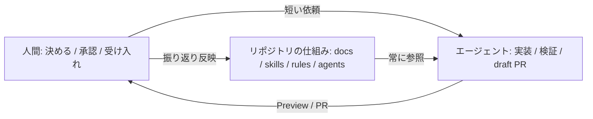
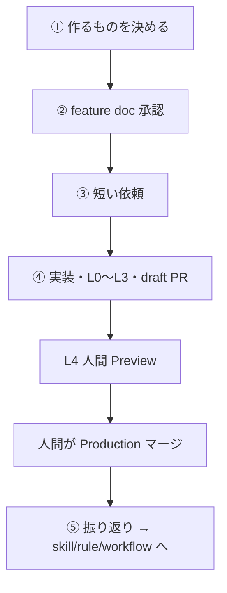

# AI フル活用の開発プロセス入門（QA向け）

この資料は、**QAエンジニア**が「AIエージェントとどう協業するか」を理解するための入門です。  
プロダクト自体の説明はしません。**開発の進め方・仕組み・用語**に絞ります。

読むと分かること:

- AIに「うまく働いてもらう」ための4つの考え方
- リポジトリに置いている仕組み（ルール・スキル・サブエージェントなど）
- 人間（特にQA）とエージェントの役割分担
- 受け入れ（L4）までの検証の考え方

正本の詳細は末尾の関連ドキュメントを参照してください。この資料は**地図**です。

---

## 1. ひとことで言うと

従来の「人が仕様を書いて人が実装し人がテストする」に対し、このリポジトリでは:

1. **振る舞いの契約**（feature doc）を人間が決める
2. **実装・自己検証・draft PR**はエージェントが担う
3. **受け入れの最終判断**は人間（QA）が Preview で行う
4. 失敗や抜け漏れは、次から繰り返さないよう **仕組みに書き戻す**

つまり「AIに丸投げ」ではなく、**AIが外れにくいレールをリポジトリに敷く**開発です。



---

## 2. 知っておくとよい4つの考え方

用語の理解が浅い前提で説明します。実務では厳密な定義より、「何を設計しているか」の感覚が重要です。

### 2.1 プロンプトエンジニアリング（Prompt Engineering）

**定義:** エージェントへの**依頼文の書き方**を工夫すること。

悪い例（長い仕様をチャットに全部書く）:

```text
レシピ一覧を作って。タイトルと日付が見えて、空のときは案内が出て、
ログイン必須で、モバイルでも見やすくて、SQLはこうで…
```

良い例（このリポジトリの方針）:

```text
feature doc: docs/product/features/recipe-list.md
vision: docs/product/vision.md

上記 feature doc の §1〜6（とくに §5 Gherkin と §6）を満たす実装と draft PR まで。
やらないことは §4 に従う。マージしない。
```

ポイント:

- **依頼文は短く**、詳細はドキュメントに置く
- 「何をもって完了か」「やってはいけないこと」を明示する
- Production マージは人間、など**境界**を書く

QAとの関係: プロンプトを上手く書くのは主に依頼者の仕事ですが、**受け入れ可能な条件を feature doc に書くこと自体が、良いプロンプトの土台**になります。

---

### 2.2 コンテキストエンジニアリング（Context Engineering）

**定義:** エージェントが「今なにを見て考えるか」を設計すること。  
モデルは会話・ファイル・ルールを全部一度に完璧には抱えられません。**必要な情報を、必要なタイミングで届ける**のがコンテキスト設計です。

このリポジトリでの置き場所:

| 置き場所 | いつ読まれるか | 何を置くか |
| --- | --- | --- |
| `AGENTS.md` | ほぼ毎回 | コマンド、地図、絶対守ること（短く） |
| `.cursor/rules/*.mdc` | 該当パスの編集時 | その領域だけの制約 |
| `docs/` | 参照したとき | vision / feature / workflow など長めの正本 |
| feature doc | 実装・検証の契約 | 振る舞い・Gherkin・受け入れ条件 |
| スキル / サブエージェント | タスクに応じて | 手順や独立した判定 |

悪い例:

- `AGENTS.md` に全チェックリストを詰め込み、毎回トークンを浪費する
- 仕様が Issue・チャット・PRに散らばり、どれが正本か分からない

良い例:

- 常時必要なことだけ always-on
- 振る舞いの正本は feature doc 1枚
- 長い手順はスキルに分離（必要なときだけ読む）

QAとの関係: **§5 Gherkin / §6 受け入れ条件を検証可能な文で書く**ことが、エージェント（と後から見る人間）への最良のコンテキスト提供です。「いい感じ」「使いやすい」はコンテキストになりません。

---

### 2.3 ハーネスエンジニアリング（Harness Engineering）

**定義:** エージェントが**安全に・再現可能に動ける土台（ハーネス）**を整えること。  
プロンプトやドキュメントだけでは、環境差分・手動セットアップ・曖昧な「完了」で破綻します。

ハーネスの例（このリポジトリ）:

| 種類 | 実体 | 役割 |
| --- | --- | --- |
| 実行環境 | `.cursor/environment.json` + Cloud の install/start | 起動時に Docker / Supabase / 依存関係 / dev server を用意 |
| 検証手順 | `verify-frontend-change` などのスキル | 「ファイルを直した＝完了」を禁止し、ブラウザ確認まで強制 |
| 自動テスト | Vitest / Playwright / CI | 定量的な合否（exit code） |
| 権限・安全 | マージは人間（D1）、secrets をコミットしない | エージェントの権限境界 |
| テンプレ | feature doc / PR テンプレ | 抜け漏れをフォーマットで防ぐ |

イメージ:

```text
プロンプトだけ     → 「頑張って」と頼む
ハーネスあり       → 「同じレール上で走らせ、完了条件を機械的に確認できる」
```

QAとの関係: L0〜L3 の多くはハーネス側（エージェント / CI）が担います。QAは**ハーネスが拾いきれない最終判断（L4）**と、ハーネスの穴を見つけて仕組みに戻す役割です。

---

### 2.4 ループエンジニアリング（Loop Engineering）

**定義:** 「集める → やる → 確かめる → 繰り返す」を、**停止条件付き**で設計すること。

```text
gather context → act → verify → repeat until stop
```

ループの種類（ざっくり）:

| 種類 | 例 | いつ止まるか |
| --- | --- | --- |
| ターン型 | 普通のチャット依頼 | エージェントが完了と判断 / 人間に聞く |
| ゴール型 | 「lint 0・コンソールエラー0まで」 | 完了条件を満たす / 試行上限 |
| 振り返り型 | workflow ⑤ | 繰り返しリスクを skill/rule に書いた |

重要な原則:

- **「編集した」は完了ではない。検証して初めて完了**
- 実装した本人の「OK」は弱い。**別コンテキストの判定者**を置く（後述のサブエージェント）
- 同じ失敗が繰り返されるなら、ループの外に出して **スキル / ルール / CI に固定**する

QAとの関係: feature doc の §5 / §6 がゴール型ループの停止条件です。L4 で落ちた観点は、可能なら doc か skill に1行足し、次のループで同じ穴を踏みにくくします。

---

### 2.5 4つはどう繋がるか

| 層 | 問い | このリポジトリでの答え |
| --- | --- | --- |
| プロンプト | どう頼むか | 短い依頼 + feature doc 参照 |
| コンテキスト | 何を見せるか | AGENTS / rules / docs / skills の分担 |
| ハーネス | どこで・どう検証するか | Cloud環境・テスト・検証スキル・権限境界 |
| ループ | いつ止まるか・どう改善するか | L0–L4、サブエージェント判定、⑤振り返り |

---

## 3. リポジトリ上の「仕組み部品」

Cursor（IDE / Cloud Agent）向けに、次の部品をリポジトリに置いています。

```text
リポジトリ
├── AGENTS.md                 … 毎回読む短い地図
├── docs/                     … 長い正本（workflow / feature / 方針）
└── .cursor/
    ├── rules/                … パス限定の制約
    ├── skills/               … 手順書（オンデマンド）
    ├── agents/               … サブエージェント（独立した判定者）
    └── environment.json      … Cloud 実行環境のハーネス
```

### 3.1 Rules（ルール）

- **Always-on**: プロジェクト全体の不変条件
- **Path-scoped**: 例）migration 編集時だけ「RLS と grant を忘れるな」

「やってはいけない / 常にこうする」を短く書く場所です。長い手順は入れません。

### 3.2 Skills（スキル）

**スキル = エージェントが自分で辿る手順書**です。

| スキル例 | いつ使うか |
| --- | --- |
| `recipe-feature` | レシピ CRUD の実装手順 |
| `supabase-migration` | テーブル / RLS / grant |
| `ui-design` | 見た目・ランディング |
| `verify-frontend-change` | UI変更後の自己検証（完了宣言前に必須） |
| `run-tests` | unit / E2E の実行手順 |

ポイント:

- スキルは**実装側が従うチェックリスト**
- 「できたかどうかの判定」をスキルだけに任せるのは弱い（本人バイアスがある）

### 3.3 Subagents（サブエージェント）

**サブエージェント = 別の会話コンテキストで動く専門エージェント**です。  
親エージェントの「自分で実装して自分で合格」を避けるための**判定者**です。

| サブエージェント | 役割 | 段階 |
| --- | --- | --- |
| `feature-doc-reviewer` | feature doc の抜け漏れチェック | ② |
| `code-reviewer` | diff の第二レビュー（危険変更の事前確認） | ④ |
| `db-security-auditor` | 適用後DBで RLS / grant を検証 | ④ |
| `acceptance-verifier` | §5 / §6 をブラウザで実行（L2 / L3） | ④-3 |

スキルとの違い:

| | Skills | Subagents |
| --- | --- | --- |
| 目的 | 手順を踏む | 独立して判定する |
| 文脈 | 親の会話を引き継げる | **引き継がない**（必要情報を渡す） |
| 典型 | 実装・自己検証 | レビュー・受け入れ相当 |

### 3.4 Feature doc（振る舞いの契約）

主読者は **QA / プロダクト**です。技術詳細（SQL、ファイル構成）は必須ではありません。

必須は §1〜6:

| § | 内容 |
| --- | --- |
| 1 | ひとことで |
| 2 | だれの・どんな場面か |
| 3 | できること |
| 4 | やらないこと |
| 5 | 操作の流れ（**Gherkin**: Given / When / Then） |
| 6 | 受け入れ条件（検証可能な文） |

これがエージェント実装の契約であり、QAの受け入れ観点の正本です。

### 3.5 Hooks / CI（必要に応じて）

「毎回必ず」守らせたいことは、プロンプトより **CI や hook** の方が信頼できます。  
モデルは圧力下でルールを見落とすことがあるためです。

---

## 4. 開発フロー①〜⑤（QAの視点）

正本: [`workflow.md`](./workflow.md)

| 段階 | 何をするか | 主担当 | QAがやること |
| --- | --- | --- | --- |
| ① 決める | 今やるスライスを切る（Issue + vision） | 人間 | 必要ならスコープ確認 |
| ② ドキュメント化 | feature doc §1〜6 | 人間が承認（下書きはエージェント可） | **§1〜6の承認**（契約の合意） |
| ③ 依頼 | 短いプロンプトで実装依頼 | 人間 | 依頼文の確認（任意） |
| ④ 実装〜Preview | 実装・自己検証・draft PR・L0–L3 | エージェント中心 | **L4（人間 Preview）**、スコープ逸脱の確認 |
| Production | main マージ | **人間のみ** | レビュー後マージ（または合意） |
| ⑤ 振り返り | 繰り返しリスクを仕組みへ | エージェントが自分から | 必要なら観点の追加を依頼 |

重要なゲート:

- **②未承認のまま④に入らない**（「ワークフローに沿って」だけでは承認ではない）
- エージェントは **draft PR まで。Production マージしない（D1）**
- L4 OK / マージ後、エージェントは⑤を**自分から**始める



---

## 5. テストレベル L0〜L4（QAが知るべき地図）

正本: [`test-level-policy.md`](./test-level-policy.md)

「全部を毎回人間がやる」ではなく、**変更タイプに応じて積み上げる**方針です。

| Level | 誰が | 何をするか |
| --- | --- | --- |
| **L0** | エージェント / CI | lint / build / unit |
| **L1** | エージェント / CI | 既存 E2E（回帰） |
| **L2** | エージェント（`acceptance-verifier`） | local で §5 / §6 をブラウザ確認 |
| **L3** | エージェント | Preview 上で L2 相当（env/デプロイ絡みのとき） |
| **L4** | **人間（QA）** | Preview での最終受け入れ |

ルール表の感覚（抜粋）:

- docs / 文言のみ（振る舞い不変）→ **L0 のみ**
- 新規画面・新規フロー → **L0 + L2 + L4**
- ログイン・権限拡大・物理削除 → **L4 必須**になりやすい
- L3 → local と Preview で差が出る変更のとき

PR 本文に Test level が書かれます。QAは:

1. 必須レベルが妥当か見る（軽すぎ/重すぎを指摘してよい）
2. L4 が必要なとき、feature doc §5 / §6 に沿って Preview 確認する
3. 「振る舞い不変で L4 省略」は覆せる

---

## 6. QAの実務チェックリスト

### ② feature doc 承認時

- [ ] §5 が画面で観察できる Gherkin になっている
- [ ] §6 が検証可能な文（「いい感じ」禁止）
- [ ] §4「やらないこと」が切れている
- [ ] 承認者欄に人間の名前がある

### ④ L4 Preview 時

- [ ] PR の Links から feature doc に辿れる
- [ ] §5 の各 Scenario を確認した
- [ ] §6 の合格条件を確認した
- [ ] §4 の範囲外実装が混ざっていない
- [ ] フィードバックは「次に同じ穴を踏まない一文」も意識する（doc / skill への反映候補）

### エージェントに戻すフィードバックの型

悪い例: 「なんか変」  
良い例: 「Scenario X: 空状態で案内が見えない。§5 の Then を満たしていない」

修正側のルール: エージェントは Preview だけ直して再依頼せず、**local で再現→修正→確認してから** Preview 再確認を依頼します。

---

## 7. 「AIフル活用」で起きがちな誤解

| 誤解 | 実際 |
| --- | --- |
| AIが全部決めてくれる | ①②と L4・マージは人間 |
| 長いプロンプトほど良い | 詳細は feature doc。依頼は短い |
| エージェントが「OK」と言えば終わり | L2/L3 は別エージェント、L4 は人間 |
| 一度直せば十分 | ⑤で仕組みに戻さないと同じ失敗が再発する |
| QAはコードを全部読む必要がある | 主戦場は振る舞い契約と Preview。危険変更は事前にサブエージェントが見る |

---

## 8. 関連ドキュメント（詳しく知りたいとき）

| 知りたいこと | ドキュメント |
| --- | --- |
| ①〜⑤の正本 | [`workflow.md`](./workflow.md) |
| 役割・依頼テンプレ | [`agent-collaboration.md`](./agent-collaboration.md) |
| rules / skills / agents の置き方 | [`steering.md`](./steering.md) |
| ループの考え方 | [`loops.md`](./loops.md) |
| L0–L4 ルール表 | [`test-level-policy.md`](./test-level-policy.md) |
| feature doc テンプレ | [`../product/features/_template.md`](../product/features/_template.md) |
| サブエージェント一覧 | [`.cursor/agents/README.md`](../../.cursor/agents/README.md) |
| スキル一覧 | [`.cursor/skills/README.md`](../../.cursor/skills/README.md) |

---

## 付録: 用語の超短縮メモ

| 用語 | 一言 |
| --- | --- |
| Prompt Engineering | 依頼文の設計 |
| Context Engineering | 「何を見せて考えさせるか」の設計 |
| Harness Engineering | 環境・検証・権限など土台の設計 |
| Loop Engineering | 検証付きの繰り返しと停止条件の設計 |
| Skill | エージェントが辿る手順書 |
| Subagent | 独立コンテキストの専門エージェント（主に判定） |
| Rule | 常時 or パス限定の制約 |
| Feature doc | QA向けの振る舞い契約（受け入れの正本） |
| L4 | 人間による Preview 受け入れ |
