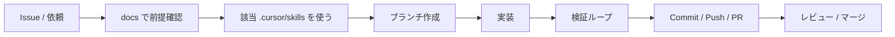

# Development workflow

Cursor エージェントと人間が同じ流れで進めるための開発フローです。

## 原則

1. **小さく出す** — 1 PR = 1 意図（機能 / 修正 / ドキュメント）
2. **ドキュメント先行または同時** — 仕様が変わるなら `docs/` も同じ PR
3. **推測で広げない** — 未決定は実装せず、質問するか ADR / vision に「未決定」と書く
4. **検証してから完了** — 該当スキル（特に `verify-frontend-change`）と `lint` / 必要なら `build`

## 標準フロー



### 1. 前提確認

- [`../product/vision.md`](../product/vision.md) — スコープ内か
- [`../architecture/overview.md`](../architecture/overview.md) — 置き場所・制約
- [`steering.md`](./steering.md) — rules / skills / agents の使い分け
- [`.cursor/skills/`](../../.cursor/skills/) — 該当手順

### 2. ブランチ

```bash
git checkout main
git pull origin main
git checkout -b cursor/<short-description>
```

Cloud Agent では指定サフィックス付きブランチ名に従う。

### 3. 実装

- Next.js 16 の公式 docs（`node_modules/next/dist/docs/`）を確認してから API を使う
- UI は `ui-design` スキル、DB は `supabase-migration` スキルに従う
- レシピ機能は `recipe-feature` スキルに従う

### 4. 検証ループ

詳細は [`loops.md`](./loops.md)。最低限:

- [ ] 該当する verify / migration チェックリストを実行した
- [ ] `npm run lint` が通る
- [ ] UI 変更なら dev で画面確認（`verify-frontend-change`）
- [ ] マイグレーション追加時は `supabase db reset`（または同等）で適用確認
- [ ] `docs/` / `AGENTS.md` が実装と一致している

### 5. PR

- タイトルは「何をしたか」が分かる一文
- 本文に: 目的 / 変更点 / 検証方法 / 関連 docs
- 任意: `.cursor/agents/code-reviewer` で二次レビュー
- レビュー観点: スコープ逸脱、RLS/grant 漏れ、秘密情報の混入

## エージェント運用（Cursor）

| 役割 | 参照 |
| --- | --- |
| 常時エントリ | `AGENTS.md`, `.cursor/rules/`（`alwaysApply` / `globs`） |
| プロジェクト知識 | `docs/` |
| 手順 | `.cursor/skills/*/SKILL.md` |
| 隔離タスク | `.cursor/agents/*.md` |
| 決定的自動化 | `.cursor/hooks.json`（必要になったら追加） |

## ローカル Supabase（データ機能を触るとき）

詳細は `AGENTS.md` の Cloud 手順、および README の Getting started を参照。

要約:

1. Docker daemon 起動（Cloud VM では手動）
2. `supabase start`
3. `.env.local` に `API_URL` / `ANON_KEY` を設定
4. スキーマ変更後は `supabase db reset` で再適用
