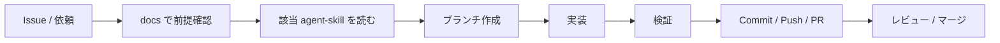

# Development workflow

AI エージェントと人間が同じ流れで進めるための開発フローです。

## 原則

1. **小さく出す** — 1 PR = 1 意図（機能 / 修正 / ドキュメント）
2. **ドキュメント先行または同時** — 仕様が変わるなら `docs/` も同じ PR
3. **推測で広げない** — 未決定は実装せず、質問するか ADR / vision に「未決定」と書く
4. **検証してから完了** — `lint` / 必要なら `build`、データ系はローカル Supabase で確認

## 標準フロー



### 1. 前提確認

- [`../product/vision.md`](../product/vision.md) — スコープ内か
- [`../architecture/overview.md`](../architecture/overview.md) — 置き場所・制約
- [`../../agent-skills/README.md`](../../agent-skills/README.md) — 該当スキル

### 2. ブランチ

```bash
git checkout main
git pull origin main
git checkout -b cursor/<short-description>
```

Cloud Agent では指定サフィックス付きブランチ名に従う。

### 3. 実装

- Next.js 16 の公式 docs（`node_modules/next/dist/docs/`）を確認してから API を使う
- UI は既存の見た目を壊さない。大きなデザイン変更は `ui-design` スキルに従う
- DB 変更は `supabase-migration` スキルに従う

### 4. 検証チェックリスト

- [ ] `npm run lint` が通る
- [ ] 変更が UI に関わるなら `npm run build` または `npm run dev` で確認
- [ ] マイグレーション追加時は `supabase db reset`（または同等）で適用確認
- [ ] `docs/` / `AGENTS.md` の記述が実装と一致している

### 5. PR

- タイトルは「何をしたか」が分かる一文
- 本文に: 目的 / 変更点 / 検証方法 / 関連 docs
- レビュー観点: スコープ逸脱、RLS/grant 漏れ、秘密情報の混入

## エージェント運用

| 役割 | 参照 |
| --- | --- |
| 常時ルール | `AGENTS.md`, `.cursor/rules/` |
| プロジェクト知識 | `docs/` |
| 手順付き専門知識 | `agent-skills/*/SKILL.md` |

エージェントは作業開始時に:

1. `AGENTS.md` を読む（自動適用される場合もある）
2. タスク種別に応じて `agent-skills/` を選ぶ
3. 完了時に docs の更新漏れがないか確認する

## ローカル Supabase（データ機能を触るとき）

詳細は `AGENTS.md` の Cloud 手順、および README の Getting started を参照。

要約:

1. Docker daemon 起動（Cloud VM では手動）
2. `supabase start`
3. `.env.local` に `API_URL` / `ANON_KEY` を設定
4. スキーマ変更後は `supabase db reset` で再適用
