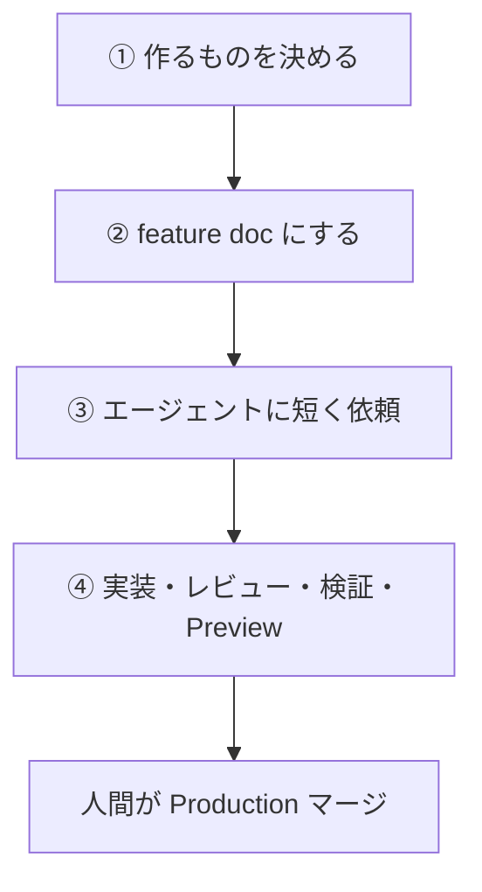

# Development workflow（4段階）

Cursor エージェントと人間が同じ流れで進めるための開発フローです。

合意済みの方針:

| 項目 | 決定 |
| --- | --- |
| ①の成果物 | **A2** — GitHub Issue + `docs/product/vision.md` の状態更新 |
| ②の厚み | **B2** — feature doc 1枚必須（QA向け・振る舞い中心） |
| ③の依頼の切り方 | **未決定**（実装開始時に決める。依頼文は短く保つ） |
| ④のデプロイ | **D1** — Preview までエージェント可、Production マージは人間 |
| ④のテストレベル | **レベル定義は合意**（L0–L4）。必須の付け方はスコア／ルール表で別途 |



---

## 役割分担

| 段階 | 主担当 | エージェント |
| --- | --- | --- |
| ① 決める | 人間 | 壁打ちのみ（実装しない） |
| ② ドキュメント化 | 人間が承認 / 下書きはエージェント可 | feature doc 下書き・抜け漏れ指摘 |
| ③ 依頼 | 人間 | （まだ実装しない） |
| ④ 実装〜Preview | エージェント中心 | 実装・自己検証・draft PR |
| Production | **人間のみ** | 依頼されてもマージしない（原則） |

---

## ① 作るものを決める（成果物: A2）

### 目的

今やることを1スライスに絞る。

### やること

1. ユーザー価値を一文で書く
2. In / Out を切る（やらないことを先に書く）
3. `docs/product/vision.md` の該当行を「着手中」などに更新する
4. GitHub Issue を作る（タイトル + 上記の要約。詳細仕様は②へ）

### やらないこと

- この段階で実装依頼を出さない
- 長い設計書を書かない（②へ）

### 出口（これがあれば①完了）

- [ ] Issue がある
- [ ] `vision.md` の状態が更新されている
- [ ] 「作るもの / やらないこと / 成功イメージ」を復唱できる

---

## ② 作るものをドキュメント化する（厚み: B2）

### 目的

実装者（エージェント）が推測しなくてよい **振る舞いの契約** を残す。

### 必須成果物

`docs/product/features/<feature-name>.md` を1枚用意する。

テンプレート: [`../product/features/_template.md`](../product/features/_template.md)

### 書き方の方針（QA向け）

feature doc の主読者は **QA / プロダクト** です。

**必須（§1〜6）**

| § | 内容 |
| --- | --- |
| 1 | ひとことで言うと |
| 2 | だれの・どんな場面か（**ユーザー課題と提供価値を含む**） |
| 3 | できること |
| 4 | やらないこと |
| 5 | 操作の流れ（**Gherkin**: Given / When / Then） |
| 6 | 受け入れ条件（確認メモもここに一本化） |

**任意（§7以降・付録）** — 空でも②は完了可。書いてあればレビュー対象。

次は **書かなくてよい**（エージェントまたは付録に任せる）。

- テーブル定義の SQL、RLS の詳細
- ファイルパスやコンポーネント構成
- Server Components / ライブラリ選定の長文

### 進め方

1. `_template.md` をコピーして feature 名のファイルを作る
2. 人間が書くか、エージェントに下書きさせて人間が **§1〜6** を承認する
3. Issue から feature doc へリンクする

### 出口（これがあれば②完了）

- [ ] feature doc がある
- [ ] §1〜6 が埋まっている
- [ ] §2 にユーザー課題と提供価値がある
- [ ] §5 が Gherkin である
- [ ] §6 が検証可能な文である（「いい感じ」禁止）
- [ ] Issue から辿れる

---

## ③ エージェントに依頼する

### 目的

②を読ませて、短く実行依頼する。

### 方針

- **依頼文は短く**（詳細は feature doc に置く）
- 実装の切り方（1依頼か分割か）は **実装開始時に決める**（論点Cは保留）
- テンプレを長くしない。足りない情報は doc 側を直す

### 短い依頼テンプレ

```text
feature doc: docs/product/features/<name>.md
vision: docs/product/vision.md

上記 feature doc の §1〜6（とくに §5 Gherkin と §6）を満たす実装と draft PR までお願いします。
やらないことは §4 に従うこと。マージはしないでください。
```

必要なら1行足すだけにする例:

```text
DBが未作成なら migration も同じPRで。UI変更後は verify-frontend-change まで。
```

### 出口

- [ ] 依頼文が短い
- [ ] feature doc のパスが明示されている
- [ ] 「マージしない」が明示されている（D1）

---

## ④ 実装・レビュー・検証・デプロイ（デプロイ: D1）

### ④-1 実装（エージェント）

1. ブランチ作成
2. feature doc の受け入れ条件を満たすよう実装
3. 関連 skills を使う（`.cursor/skills/`）
4. 自己検証のうえ **draft PR**（マージしない）

### ④-2 レビュー

| 観点 | 主担当 |
| --- | --- |
| 受け入れ条件を満たすか（画面・操作） | **人間（QA）** |
| やらないことをやっていないか | 人間 |
| 危険な変更（秘密情報、破壊的DBなど） | 人間 + 任意で `code-reviewer` |
| コード詳細 | 必須ではない（QAが全部見なくてよい） |

### ④-3 検証（テストレベル）

レベル定義の正本: [`test-level-policy.md`](./test-level-policy.md)

| Level | 要約 |
| --- | --- |
| L0 | 静的（lint / build / 将来 unit） |
| L1 | local の既存 E2E 等（回帰） |
| L2 | エージェント + Playwright MCP（local、feature doc） |
| L3 | エージェントが Preview で再検証（スコア表次第で外してもよい） |
| L4 | 人間が Preview で手動受け入れ（**常時必須ではない**） |

スコア／ルール表が決まるまでの暫定:

- コード変更は少なくとも L0
- feature 実装は L2 推奨（不可なら PR に理由）
- L4 は振る舞い変更・新規画面・PR作成者が必要と判断したとき
- 「振る舞い不変」の一次判定は PR 作成者（QA は覆せる）

### ④-4 デプロイ（D1）

| 環境 | 誰がやるか |
| --- | --- |
| Vercel Preview（PR） | エージェント / CI で作成してよい |
| Production（main マージ後） | **人間がレビュー後にマージ** |
| 本番DB migration・env | 人間（または人間が明示依頼したときだけ） |

### 出口（④完了 → 次機能へ）

- [ ] 受け入れ条件を人間が確認した
- [ ] draft → レビュー → **人間がマージ**
- [ ] Preview で問題ないことを確認してから Production
- [ ] `vision.md` の状態を更新（完了 / 一部残など）

---

## 関連ドキュメント

- ステアリング（rules / skills / agents）: [`steering.md`](./steering.md)
- 検証ループの考え方: [`loops.md`](./loops.md)
- 依頼・役割の補足: [`agent-collaboration.md`](./agent-collaboration.md)
- テストレベル方針（TBD）: [`test-level-policy.md`](./test-level-policy.md)
- feature テンプレ: [`../product/features/_template.md`](../product/features/_template.md)
