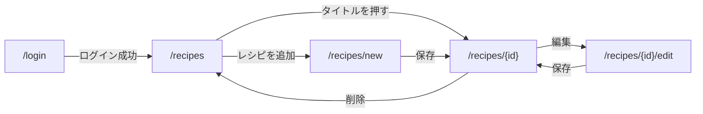
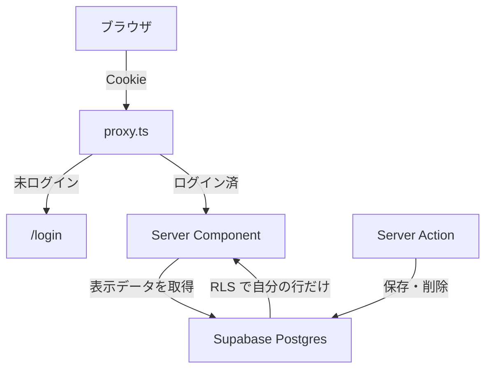

# My Recipe — プロダクト & 技術構成 紹介（QA向け）

社内QAメンバーが **このプロダクトをテストできる状態になる**ための紹介資料です。

## この資料の使い方

| | |
| --- | --- |
| 想定読者 | 社内QAメンバー（このプロダクトを初めて触る人） |
| 目的 | 何のアプリか・どう動いているか・どこにバグが出やすいかを掴む |
| 読み方 | §1〜§2 で全体像。テスト実務に直結するのは **§5（落とし穴）と §6（環境）** |
| 姉妹資料 | 開発プロセス側は [`../development/ai-dev-process-for-qa.md`](../development/ai-dev-process-for-qa.md)（AI活用・HITL・L0〜L4） |

この資料は「プロダクトと技術」、姉妹資料は「開発の進め方」を扱います。重複は避けています。

### 30秒サマリ

- **My Recipe** は、自分専用のレシピを保存・検索・編集・削除する個人向け Web アプリです
- **ログイン必須**で、**自分のレシピしか見えません**。サインアップ画面は無く、ユーザーは手動作成します
- 画面は5つ（ログイン / 一覧 / 詳細 / 追加 / 編集）。MVPは 2026-08-12 に完了しています
- 技術は **Next.js 16（App Router）+ Supabase（Postgres）+ Vercel**。画面のデータ取得はサーバ側で行われます
- 「他人のデータが見えない」保証の本体は **DB側の RLS** です。画面側のリダイレクトは補助にすぎません
- テストで一番踏みやすい落とし穴は、**所要時間が未入力のレシピが絞り込みに出てこない**ことと、**Preview 環境にDB変更が自動適用されない**ことです（§5・§6）

---

## 1. プロダクト概要

### 1.1 何のアプリか

料理レシピを自分用に溜めて、後から探して使うためのシンプルな Web アプリです。  
「メモアプリに散らばって探せない」を「一箇所に集めてすぐ開ける」にすることが価値です。

正本: [`vision.md`](./vision.md)

### 1.2 想定ユーザーと前提

| 項目 | 内容 |
| --- | --- |
| 想定ユーザー | 自分用にレシピを溜めたい個人 |
| 認証 | **必須**。ログインしないとレシピの閲覧・操作は一切できない |
| ユーザー登録 | **セルフサインアップ画面は無い**。ユーザーは Supabase Dashboard などから手動作成（§6.3） |
| データの見え方 | **ユーザーごとに完全分離**。他ユーザーのレシピは見えない・操作できない |
| 共有機能 | 非スコープ（他ユーザーとの共有は作らない） |

QA的に重要なのは、**「ユーザー登録」という機能が存在しない**ことです。テストアカウントは自分で用意します。

### 1.3 スコープと非スコープ

MVP（すべて完了済み）:

| 優先度 | 機能 | feature doc |
| --- | --- | --- |
| P0 | 認証（ログイン・ログアウト） | [`features/auth.md`](./features/auth.md) |
| P0 | レシピ一覧（検索・絞り込み・ソート・ページネーション） | [`features/recipe-list.md`](./features/recipe-list.md) |
| P0 | レシピ詳細 | [`features/recipe-detail.md`](./features/recipe-detail.md) |
| P0 | レシピ追加 | [`features/recipe-create.md`](./features/recipe-create.md) |
| P1 | レシピ編集 | [`features/recipe-edit.md`](./features/recipe-edit.md) |
| P1 | レシピ削除 | [`features/recipe-delete.md`](./features/recipe-delete.md) |

**当面やらないこと**（不具合ではなく仕様です）:

- 画像アップロード・サムネイル
- 他ユーザーとの共有・SNS 連携
- 栄養計算・カロリー管理
- ネイティブアプリ、多言語対応
- パスワードリセット、ソーシャルログイン、多要素認証
- 論理削除・ゴミ箱・削除の取り消し（削除は**物理削除のみ**）

各画面の「やらないこと」は feature doc の §4 が正本です。**受け入れ判定は feature doc の §5 / §6 で行います。**

---

## 2. 画面と機能

### 2.1 画面一覧

| 画面 | URL | 役割 | 未ログインで開くと |
| --- | --- | --- | --- |
| ログイン | `/login` | メール + パスワードでログイン | そのまま表示される |
| 一覧 | `/recipes` | 検索・絞り込み・ソート・ページ送り | `/login` にリダイレクト |
| 詳細 | `/recipes/[id]` | 1件の全項目表示、編集・削除の導線 | `/login` にリダイレクト |
| 追加 | `/recipes/new` | 新規レシピの入力・保存 | `/login` にリダイレクト |
| 編集 | `/recipes/[id]/edit` | 既存レシピの修正・保存 | `/login` にリダイレクト |

ルート（`/`）は独立した画面を持たず、**未ログインなら `/login`、ログイン済みなら `/recipes`** に振り分けられます。ログイン済みで `/login` を開いた場合も `/recipes` に飛びます。

### 2.2 画面遷移



「キャンセル」は保存せずに戻ります（追加 → 一覧、編集 → その詳細）。

### 2.3 各画面でテストするときの着目点

**ログイン（`/login`）**

- 認証情報が誤りのとき、**どちらが間違いか分からないメッセージ**になる（「メールアドレスまたはパスワードが正しくありません」）。これは意図的な仕様です
- メール・パスワードが空なら、送信前に入力を促すエラーが出る
- ログアウトは**そのブラウザのセッションだけ**を切る（他端末のセッションは維持される）

**一覧（`/recipes`）**

- 表示は「タイトル / 所要時間 / 更新日時」の3列
- 検索は**タイトルの部分一致のみ**（材料・手順・メモは検索対象外）
- 所要時間の絞り込みは4区分（10分未満 / 10〜20分 / 20〜30分 / 30分以上）で、**選択した瞬間に反映**される（適用ボタンは無い）
- 検索・絞り込み・ソートを変えると**自動的に1ページ目に戻る**
- 1ページ10件。11件目からページネーションが出る
- 0件のときは「まだレシピがありません」、絞り込み結果が0件のときは「条件に一致するレシピがありません」と**文言が変わる**
- 検索・絞り込み・ソート・ページの状態は URL に載る（共有・再現可能）

**詳細（`/recipes/[id]`）**

- 材料は1行1項目の箇条書き、手順は1行1ステップの番号付きリストで表示される
- 未入力の項目は「未入力であることが分かる」表示になる
- 「一覧に戻る」は、**直前の一覧の状態（検索・絞り込み・ソート・ページ）を復元**する
- 他ユーザーのレシピ・存在しないID・不正な形式のIDは、いずれも**同じ「見つかりません」画面**になる（存在の有無を漏らさない設計）

**追加（`/recipes/new`）/ 編集（`/recipes/[id]/edit`）**

- 必須はタイトルのみ。所要時間・材料・手順・メモは空で保存できる
- 所要時間は**1以上の整数のみ**。`0`・小数・マイナス・文字はエラー
- 保存に成功するとそのレシピの詳細に遷移する
- 編集画面には既存の内容が入った状態で開く

**削除（詳細画面から）**

- 確認ダイアログが出る。「削除する」で**完全に削除**（取り消し不可）、「キャンセル」で詳細に留まる
- 削除後は一覧に遷移し、削除したレシピは一覧に出ない

---

## 3. 技術構成

### 3.1 スタック

| レイヤ | 採用技術 | QAが知っておくとよいこと |
| --- | --- | --- |
| フレームワーク | Next.js 16（App Router）+ React 19 | 画面のデータ取得は**サーバ側**で実行される |
| 言語 | TypeScript | 型エラーは `npm run build` で検出される |
| スタイル | Tailwind CSS 4 | ダークモード対応（OSの設定に追従） |
| DB / API | Supabase（Postgres + PostgREST） | 権限制御は**DB側の RLS**が本体 |
| 認証 | Supabase Auth（メール + パスワード） | セッションは Cookie に保存される |
| ホスティング | Vercel | PR ごとに Preview 環境が作られる |

選定理由は ADR [`../decisions/0001-stack-next-supabase-vercel.md`](../decisions/0001-stack-next-supabase-vercel.md) にあります。

### 3.2 リクエストの流れ



| 登場人物 | 実体 | 役割 |
| --- | --- | --- |
| `proxy.ts` | `src/proxy.ts` | 全リクエストの手前で走り、ログイン状態に応じてリダイレクトする（Next.js 16 では `middleware.ts` ではなく `proxy.ts`） |
| Server Component | `src/app/**/page.tsx` | サーバ上で Supabase に問い合わせ、HTML を作って返す |
| Server Action | `src/app/**/actions.ts` | フォーム送信を受けて保存・更新・削除・ログイン・ログアウトを行う |
| Supabase | Postgres + PostgREST | データ本体。RLS で行を絞る |

QA視点での意味:

- **一覧・詳細の表示は毎回サーバでDBを読みます**（`force-dynamic` 指定のため、静的にキャッシュされません）。データを直接DBに入れて画面をリロードすれば反映されます
- **ブラウザの DevTools に SQL は出ません。** データ取得はサーバ側なので、Network タブに Supabase へのリクエストは現れません。表示データの問題はサーバ側のログを見る必要があります
- 保存・削除はフォーム送信（Server Action）で行われます。API エンドポイントを直接叩く画面はありません

### 3.3 コードのどこを見ればいいか

```text
src/
  proxy.ts                  … 認証リダイレクト（全リクエストの入口）
  app/
    login/                  … ログイン画面と login アクション
    recipes/
      page.tsx              … 一覧（検索・絞り込み・ソート・ページング）
      actions.ts            … 追加・更新・削除・ログアウト
      new/                  … 追加画面
      [id]/                 … 詳細・編集・削除ボタン
  lib/
    recipes.ts              … 表示整形・URL組み立て・入力検証（unit テスト対象）
    supabase/               … Supabase クライアント生成（server / client）
supabase/
  migrations/               … テーブル・RLS・grant の変更履歴（追記のみ）
tests/e2e/                  … Playwright E2E（Page Object 付き）
```

不具合の切り分けで見る場所の目安:

| 症状 | 最初に見る場所 |
| --- | --- |
| 日付や所要時間の表示がおかしい | `src/lib/recipes.ts`（表示整形） |
| 検索・絞り込み・並び順がおかしい | `src/app/recipes/page.tsx`（クエリ組み立て） |
| 保存・削除が失敗する | `src/app/recipes/actions.ts` と DB の権限（§4.2） |
| ログインしていないのに見える / 見えるべきものが見えない | `src/proxy.ts` と RLS（§4.2） |

---

## 4. データと権限

### 4.1 `recipes` テーブル

レシピを保存するテーブルはこの1つだけです。

| 列 | 型 | 必須 | 内容 |
| --- | --- | --- | --- |
| `id` | uuid | ○ | 自動生成。URL の `[id]` に出てくる値 |
| `user_id` | uuid | ○ | 所有者。ユーザー削除時は連動して消える |
| `title` | text | ○ | タイトル（唯一の必須入力） |
| `cooking_time_minutes` | integer | − | 所要時間（分）。未入力は `NULL` |
| `ingredients` | text | − | 材料。**改行区切りで1行1項目** |
| `steps` | text | − | 手順。**改行区切りで1行1ステップ** |
| `notes` | text | − | メモ |
| `created_at` | timestamptz | ○ | 作成時刻 |
| `updated_at` | timestamptz | ○ | 更新時刻。**DBのトリガーで自動更新** |

空欄で保存した項目は空文字ではなく `NULL` で入ります。

### 4.2 RLS と grant（二重の防御）

「他ユーザーのデータが見えない」ことを担保しているのは、画面ではなく **DB側の Row Level Security（RLS）** です。

| 層 | 何をしているか | これが無いとどうなるか |
| --- | --- | --- |
| `proxy.ts` のリダイレクト | 未ログインを `/login` に送る | 未ログインでも画面が開いてしまう（ただしデータは RLS が守る） |
| **RLS ポリシー** | `auth.uid() = user_id` の行だけを SELECT / INSERT / UPDATE / DELETE できる | **他ユーザーのデータが読めてしまう** |
| `grant` | `authenticated` ロールに操作を許可する | 権限エラーで操作できない（画面は開くが保存が失敗する） |

RLS と `grant` は**両方必要**です。片方だけでは動きません。ここは実際に不具合の原因になった箇所で、**「画面は開けるのに保存だけ失敗する」ときは grant 側の疑いが濃い**です（§6.2）。

現在の権限（すべて「自分の行のみ」）:

| 操作 | ポリシー | 追加された時期 |
| --- | --- | --- |
| SELECT | `recipes_select_own` | テーブル作成時 |
| INSERT | `recipes_insert_own` | テーブル作成時 |
| UPDATE | `recipes_update_own` | 編集機能（#25）と同時 |
| DELETE | `recipes_delete_own` | 削除機能（#26）と同時 |

**機能とDB権限はセットで追加されます。** 新機能のテスト時は「アプリは新しいのにDBの権限が古い」組み合わせを疑ってください。

### 4.3 他ユーザーのデータを試すときの期待値

| 試すこと | 期待される振る舞い |
| --- | --- |
| 他ユーザーのレシピの詳細 URL を開く | 「見つかりません」画面。内容は一切見えない |
| 他ユーザーのレシピの編集 URL を開く | 同じく「見つかりません」 |
| 存在しないID・壊れた形式のIDを開く | 同じく「見つかりません」 |
| 他ユーザーのレシピを一覧で探す | そもそも一覧に出ない |

**「権限がありません（403）」ではなく「見つかりません」に統一**されています。存在の有無を漏らさないためで、意図的な設計です。

なお、DB拡張（`pg_trgm`）が API 公開スキーマに置かれていた問題を過去に修正しています（`20260730000000_move_pg_trgm_to_extensions.sql`）。レシピデータ自体は露出していませんでしたが、**DBの設定ミスは画面から見えない**という例です。

---

## 5. QAが知っておくと得する仕様と落とし穴

ここが実務で一番効く節です。いずれもコードとDBの実装から確認した挙動です。

### 5.1 所要時間が未入力のレシピは、絞り込みに出てこない

所要時間の4区分（10分未満 / 10〜20分 / 20〜30分 / 30分以上）はいずれも**値が入っている行だけ**を対象にします。したがって **所要時間が未入力（`NULL`）のレシピは、どの区分を選んでも一覧から消えます**。

「絞り込んだら件数が合わない」と感じたら、まず未入力のレシピが混ざっていないかを確認してください。仕様です。

### 5.2 編集すると一覧の並び順が変わる

`updated_at` はDBのトリガーで自動更新され、一覧の既定の並びは**更新日時の降順**です。したがって**レシピを編集すると、そのレシピが一覧の先頭に移動します**。

並び順の回帰テストをするときは、編集操作が並びを変える前提で期待値を作ってください。

### 5.3 検索はタイトルだけ

材料・手順・メモは検索対象外です。「材料名で検索できない」は不具合ではありません。

### 5.4 時刻は常に日本時間で表示される

サーバ（Vercel・ローカルのコンテナ）は UTC で動きますが、画面表示は **JST に変換**されます。表示形式は当年なら `MM/DD HH:mm`、他年なら `YYYY/MM/DD HH:mm` です。

日付境界（深夜0時前後）のテストでは、**DBの値（UTC）と画面表示（JST）が9時間ずれる**ことを前提にしてください。

### 5.5 削除は取り消せない

物理削除のみで、ゴミ箱・アーカイブ・復元はありません。テストデータを消すと戻せません。

### 5.6 ブラウザバックとキャッシュ

削除後にブラウザバックすると、Next.js のクライアントキャッシュのせいで削除済みの詳細が見えてしまう不具合が過去にありました。現在は**戻ってきたタイミングで再取得する対策**が入っています。

キャッシュ系の挙動は退行しやすいので、**削除・編集の後にブラウザバック / 進む / 再読み込みを試す**のは有効なテスト観点です。

### 5.7 フォームの Enter キー

追加・編集フォームで Enter を押すと意図せず保存される不具合が過去にありました（現在は対策済み）。**入力欄で Enter を押す**のも定番の観点です。

### 5.8 その他の細かい期待値

| 操作 | 期待値 |
| --- | --- |
| 所要時間に `0` / `1.5` / `-1` / 文字 | エラーになり保存されない |
| 所要時間を空欄で保存 | 保存できる。一覧では `−` と表示される |
| 材料・手順の空行 | 無視される（項目にならない） |
| 「キャンセル」 | 保存されない |
| 所要時間の昇順ソート | 未入力の行は末尾に並ぶ |
| 一覧の状態（検索・ページ等） | URL に反映される。URL 共有で同じ状態を再現できる |

---

## 6. 環境（local / Preview / Production）

### 6.1 3つの環境

| 環境 | 用途 | DB | 誰が使うか |
| --- | --- | --- | --- |
| **local** | 開発と一次検証（L0〜L2） | Docker 上の Supabase（ローカル） | 開発者・エージェント |
| **Vercel Preview** | PR ごとの確認（L3・L4） | **ホストされた Supabase** | QA の受け入れ確認 |
| **Production** | 本番（main マージ後） | ホストされた Supabase | 利用者 |

local の Supabase は API が `http://127.0.0.1:54321`、管理画面（Studio）が `http://127.0.0.1:54323` です。

### 6.2 Preview 環境の落とし穴（最重要）

**Vercel の Preview デプロイは、DBのマイグレーションを自動適用しません。**

アプリのコードだけが新しくなり、DBのテーブル・ポリシー・権限は古いままになり得ます。その結果:

- 画面は正しく開く
- 一覧・詳細も見える
- **保存・更新・削除だけが失敗する**

という分かりにくい症状が出ます。実際に編集機能・削除機能の受け入れで踏んだ事象です。

QAとして L4（Preview 受け入れ）をするときは:

1. その PR に**DB変更（`supabase/migrations/` の追加）が含まれるか**を確認する
2. 含まれる場合、**ホスト側DBへの適用が済んでいるか**を PR 上で確認する（適用は人間の作業です）
3. 書き込み系（保存・更新・削除）を必ず実操作で試す。表示だけの確認では検出できません

エラーメッセージには「データベースの更新権限（UPDATE）を確認してください」「削除権限（DELETE）を確認してください」という**権限起因を示す専用の文言**が用意されています。この文言が出たら、アプリのバグではなくDB適用漏れを疑ってください。

### 6.3 テストユーザーの作り方

**サインアップ画面が無い**ため、テストユーザーは手動で作ります。

- Supabase Dashboard（Production / Preview 用のホストDB）または Studio（local）からユーザーを作成する
- メール確認済みの状態にする必要があります（未確認だとログインできません）
- ユーザー分離のテストには**2人分**用意すると便利です（自分のレシピと他人のレシピを作って見え方を比較する）

### 6.4 環境変数

アプリが必要とするのは次の2つだけです。

| 変数 | 用途 |
| --- | --- |
| `NEXT_PUBLIC_SUPABASE_URL` | 接続先の Supabase |
| `NEXT_PUBLIC_SUPABASE_ANON_KEY` | 公開用キー（RLS 前提で安全） |

**環境変数が未設定のときは、保存時に「Supabase が設定されていません」というエラーになります。** 画面が真っ白になる代わりにメッセージが出る作りなので、この文言を見たら環境設定側の問題です。

---

## 7. テストの構成

正本: [`../development/testing.md`](../development/testing.md) / 実行手順は [`.cursor/skills/run-tests/SKILL.md`](../../.cursor/skills/run-tests/SKILL.md)

### 7.1 2層構成

| 層 | ツール | コマンド | 対象 | 規模 |
| --- | --- | --- | --- | --- |
| Unit | Vitest | `npm run test:unit` | `src/lib/` の純粋関数（日付変換・入力検証・URL組み立て） | 約42ケース |
| E2E | Playwright | `npm run test:e2e` | ブラウザ操作でフロー全体 | 6ファイル・約64ケース |

**画面コンポーネント単体のテストは意図的に作っていません。** 表示ロジックは `src/lib/` に寄せて Unit で、画面の振る舞いは E2E で見る方針です。

### 7.2 E2E の構造と制約

- 画面ごとに **Page Object**（`tests/e2e/pages/`）があり、セレクタはそこに集約されています。UIの文言やDOMが変わったときに直す場所が1箇所で済みます
- **並列実行しません**（`workers: 1`）。ログイン状態を共有するため、同時実行すると壊れます
- テストユーザーのメールは**実行ごとにタイムスタンプ付き**で作られます。同じアドレスを作り直すと Supabase Auth のレート制限に当たるためです
- テストデータの後片付けは psql で直接消しています
- 実行には **Supabase と dev server の起動が前提**です

### 7.3 どのレベルをいつ実施するかは別資料

変更内容に応じた必須テストレベル（L0〜L4）の決め方は、開発プロセス側の資料に分離しています。

- レベル定義とルール表: [`../development/test-level-policy.md`](../development/test-level-policy.md)
- QAの持ち場（②承認と L4 受け入れ）: [`../development/ai-dev-process-for-qa.md`](../development/ai-dev-process-for-qa.md)

---

## 8. 用語・略語

| 用語 | 一言 |
| --- | --- |
| App Router | Next.js の現行ルーティング方式。フォルダ構成が URL になる |
| Server Component | サーバ上で実行され、HTMLを返すコンポーネント（このアプリの一覧・詳細） |
| Server Action | フォーム送信をサーバで処理する仕組み（保存・削除・ログイン） |
| `proxy.ts` | 全リクエストの手前で走る処理。Next.js 16 での `middleware.ts` の後継 |
| Supabase | Postgres をAPI・認証込みで提供するサービス |
| PostgREST | テーブルをそのままREST APIとして公開する仕組み（Supabase の内部） |
| RLS | Row Level Security。行単位のアクセス制御。**このアプリの権限の本体** |
| grant | ロールに対する操作許可。RLS とセットで必要 |
| マイグレーション | DBの変更を記録したSQLファイル。追記のみで、過去分は書き換えない |
| Preview | PR ごとに作られる Vercel の確認環境 |
| JST 変換 | サーバはUTC、画面表示は日本時間 |

---

## 9. 関連ドキュメント

| 知りたいこと | ドキュメント |
| --- | --- |
| プロダクトのスコープ | [`vision.md`](./vision.md) |
| 各機能の受け入れ条件（QAの正本） | [`features/`](./features/) |
| 技術構成の詳細 | [`../architecture/overview.md`](../architecture/overview.md) |
| ディレクトリ規約 | [`../architecture/directory-structure.md`](../architecture/directory-structure.md) |
| スタック選定の理由 | [`../decisions/0001-stack-next-supabase-vercel.md`](../decisions/0001-stack-next-supabase-vercel.md) |
| テスト方針 | [`../development/testing.md`](../development/testing.md) |
| テストレベル（L0〜L4） | [`../development/test-level-policy.md`](../development/test-level-policy.md) |
| AI活用の開発プロセス | [`../development/ai-dev-process-for-qa.md`](../development/ai-dev-process-for-qa.md) |
